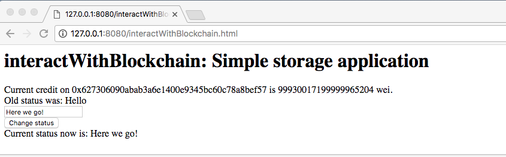
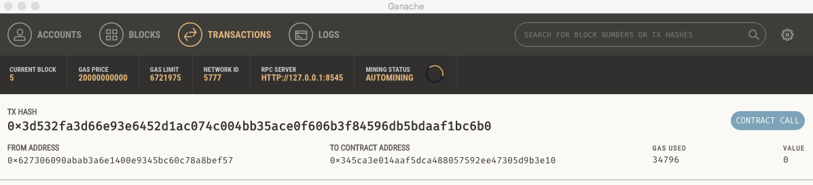
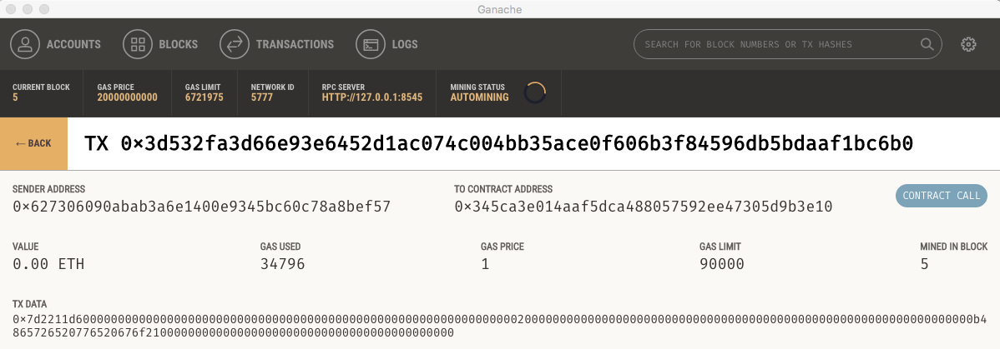

## Hello World Ethereum: Create an Ethereum smart contract and interact with it from a website

This tutorial aims at providing a simple starting point for developing Ethereum/Web applications, by showing how the main pieces (blockchain, contract, and Web server) can be put together on one's computer. We show how to install locally a simulated Ethereum blockchain, how to compile and push an Ethereum contract to that blockchain, and how to interact with it from a website and explore transaction contents.   

The contract used as an example is a 'simpleStorage' application, which allows to set and get a character string from an Ethereum contract. 


See following video for a live version of the tutorial:

<br>
<a href="https://www.youtube.com/watch?v=fYT9rc04AhY" target="_blank"></a>


Three main tools need to be installed for running this tutorial: `truffle` and `ganache`for the Ethereum development part, and `http-request` for running a local web server. These tools are based on [node.js](https://nodejs.org/en).

With these tools, it is almost straightforward to create an Ethereum contract, send it on the blockchain, and interact with it from a website. 

Note: This tutorial assumes you are comfortable with using the Linux command line.

The main steps are:

1. Set up your environment
2. Start a local Ethereum client that simulates a blockchain
3. Compile and migrate the contract to the blockchain
4. Start a local HTTP server and interact with the contract from your Web browser. 

## Environment set up

The following tools are needed:

* `npm` : Node package manager, for using Node.js. [Node.js](https://en.wikipedia.org/wiki/Node.js) is an open-source, cross-platform JavaScript run-time environment for executing JavaScript code server-side. It is a widely used environment for developing Web server applications, and is needed to use Truffle tools, Ganache and the HTTP server. To install it, see [here](https://www.npmjs.com/get-npm).

	Check that

	```
	npm -v
	node -v
	```

	work properly.

	Versions used in this tutorial:

	* npm: 5.5.1
	* node: 6.9.1

* `truffle` : [Truffle](http://truffleframework.com) is a development framework that greatly managing (compiling, migrating and testing) Ethereum contracts. See [here](https://github.com/trufflesuite/truffle) for installation.

	Main step:
	
	`
	npm install -g truffle
	`
	
	Check version with:
	
	`
	npm -g list |grep truffle
	`
	
	Version used in this tutorial: trufle@4.0.1
 
* `ganache` : [Ganache](http://truffleframework.com/ganache/) is a personal blockchain for Ethereum development. It starts a local Ethereum client that simulates an Ethereum blockchain, and provides an interface to explore the blockchain content. Installation instructions are [here](https://github.com/trufflesuite/ganache). 

	Main steps:
	
	Choose a folder where to install `ganache`, for example in your home directory, git clone the ganache repository, and install with `npm`:
	
	```
	export GANACHE_DIR=$HOME
	cd $GANACHE_DIR
	git clone https://github.com/trufflesuite/ganache
	cd ganache
	npm install
	``` 
	
	Version used in this tutorial: 1.0.1 (you can check the version in the `package.json` file).

* `http-server` : [http-server](https://www.npmjs.com/package/http-server) is a basic `Node.js` server, that will be used to server the website. See [here](https://www.npmjs.com/package/http-server) for installation.

	Main step:
	
	`
	npm install -g http-server
	`
	
	Check version with:
	
	`
	npm -g list |grep http-server
	`
	
	Version used in this tutorial: http-server@0.10.0

* This tutorial repository (which is a [Truffle project](http://truffleframework.com/docs/getting_started/project)). Choose a folder where to install, for example in your home directory, git clone the repository, and install with `npm`:

	```
	export ETHEREUM_APP=$HOME
	cd $ETHEREUM_APP
	git clone https://github.com/yannael/ethereumHelloWorld
	cd ethereumHelloWorld
	npm install
	``` 

## Start a local Ethereum client

Simply start ganache from a terminal:

```
cd $GANACHE_DIR
npm start
```

Ganache will start an Ethereum client listening by default on port 8545, create a set of 10 Ethereum accounts with 100 ether each (you are rich!), and open up a user interface where you can get account, bloks, transactions and logs information: 


Ganache provides a simple simulation of the blockchain which is very convenient for development. All the transactions will be processed instantaneously, allowing to quickly interact with the blockchain. 


## Compile and migrate contract to the blockchain

Now go the simple storage application 

```
cd $ETHEREUM_APP
```

The folder is a Truffle project. The basic components of a Truffle project are:

* `contracts` folder: Where contracts are stored. Look here to find `SimpleStorage.sol`, our contract that allows to set and get a status character string. Note: Ethereum contracts are written in [Solidity](https://solidity.readthedocs.io/en/develop/) (`.sol` extension).
* `migrations` folder: Where to define how to migrate contracts to the blockchain. Look here to find `2_deploy_contracts.js`, that defines the migration of the simple storage contract. 
* `truffle.js` file: Where to define the main configuration for the truffle project. In our case, it simply defines that the blockchain client is available on the local host at port 8545.

Now, let us compile the project:

```
truffle compile
```

This should return:


A new folder was created, `build`, in which the contracts definitions and binaries are stored in `json` files. See [this page](http://truffleframework.com/docs/getting_started/compile) for more information on Truffle compilation.

To migrate the contracts to the bock chain, use

```
truffle migrate
```

This should return:


You can see the SimpleStorage contract address is `0x345ca3e014aaf5dca488057592ee47305d9b3e10`, which was created in transaction `0x5d6f659f249801922e8f44b970ddf0c1711588556c1d8b0e2fd0b09cdc5d87cc`. See [this page](http://truffleframework.com/docs/getting_started/migrations) for more information on Truffle migration.

Going to `ganache` user interface, in the 'Transactions' tab, you should see:


The logs tab will give you logs of these tansactions and contract creations, and the accounts tab will show that some Ether were used on the first account (since deploying contracts cost Ether).  


## Interact with the contract from a website

The Web application is in `interactWithBlockchain.html`, in the main application folder. Start an HTTP server to serve the page:

`
http-server
`

It tells you the server is running at http://127.0.0.1:8080. Open the link in your browser, and open the `interactWithBlockchain.html` file. The page displays your current credit on your first Ethereum address, and allow you to change the status value in the contract. Below a screenshot of the web page, after having change the initial status 'Hello' in 'Here we go!':




The javascript code in `interactWithBlockchain.html` basically creates a contract object from the compiled contract JSON file, and interacts with using the web3 API. See the [web3 documentation](https://github.com/ethereum/web3.js/) for more information on how to interact with contracts, and other possibilities provided by the web3 API.  

You can see in Ganache that a new transaction was created, from your contract address, to the SimpleStorage contract address:



and get its content by clicking on it:



## Going further:

* A more advanced tutorial for building a pet shop Web application with Truffle: [http://truffleframework.com/tutorials/pet-shop](http://truffleframework.com/tutorials/pet-shop).
* [Truffle official documentation](http://truffleframework.com/docs/)
* [Ethereum documentation](http://www.ethdocs.org/en/latest/)
* [Web3 documentation](https://github.com/ethereum/web3.js/). 

## Donations

If you found the content useful and feel generous: 0xc81F41fdBCF8e58F0Af07858dFc5F4E6B5D1C879